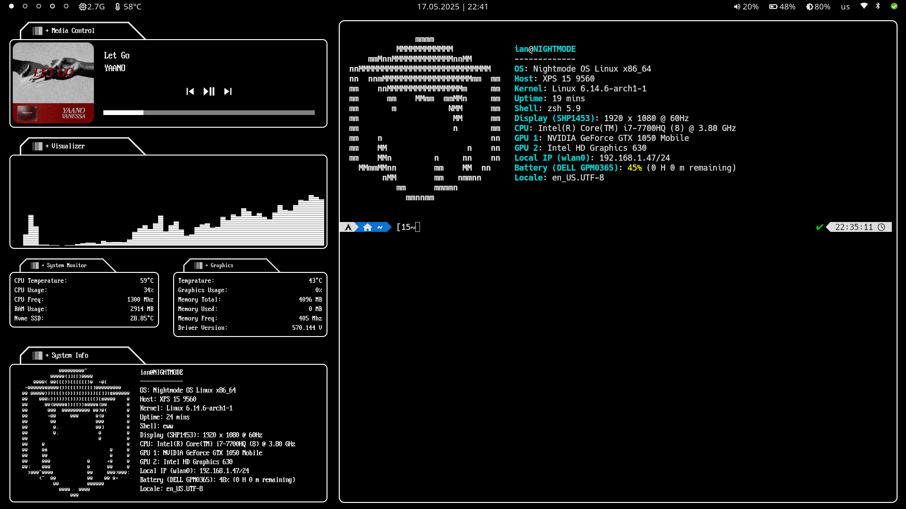

# dotfiles
Dotfiles for my NIGHTMODE season 2 inspired linux rice.

# install

1. First start with installing arch linux(if you can't figure this out on your own or are just too lazy I suggest you start with manjaro and learn your way to install wayland and uninstall the the desktop environment of your installed image).

2. Then install hyprland follow the documentation on their website or some other guide there are plenty to chose from.

3. Install waybar and eww i recomend using aur for this. Or you can go to their github pages and follow their instructions for installing.

4. copy the files from NMDesktop/1080p/.config to ~/.config (1440p is wip but functional)

5. make sure waybar and eww start with wayland (example: put 'exec-once = eww' in the hyprland.conf file)

6. restart hyprland and pray.

# Image

